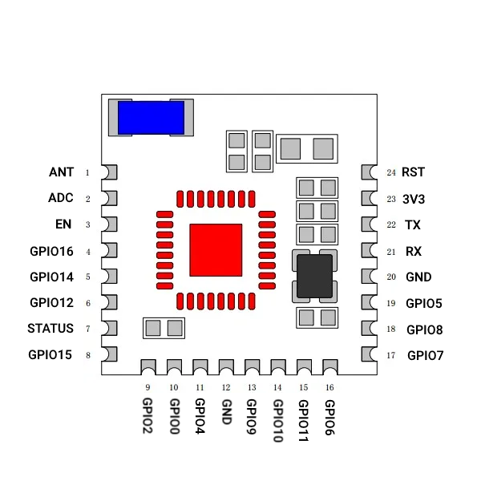

# esp-front-old

## an old board with fucking tuya code

ESP8285_Relay_X4 – 4 Relais per Web + OTA-Update (no 433Mhz)

Board: https://de.aliexpress.com/item/1005007225958599.html

Case: https://makerworld.com/en/models/148745-tuya-4ch-relay-cover

Pin ESP -> serial adapter

TX 22 ---> RX

RX 21 ---> TX

GPI00 ---> GND (connect for first flash)

connect board with USB 5V
